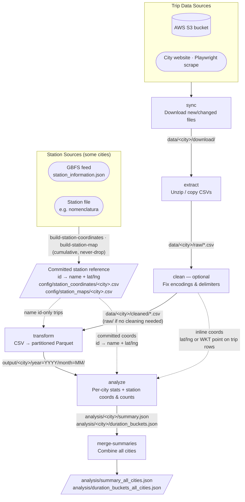

## Purpose

This bikeshare ETL pipeline cleans bikeshare data from around the world and produces Parquet datasets that are consistent across systems, so you can compare and analyze them easily.

---

## Pipeline overview



> **Where station coordinates come from.** Each city draws its station points from one of three
> sources, all resolved at **analyze** into the same per-station coordinates + trip counts:
>
> - **inline** — lat/lng (or a WKT `POINT`, e.g. Chattanooga) on every trip row, read straight
>   from the trip CSVs; no separate source (`coordinates.strategy: inline`).
> - **station file** — coordinates shipped alongside the data (e.g. Guadalajara's `nomenclatura`),
>   joined by station id.
> - **GBFS** — fetched from a live feed (e.g. Mexico City, Vancouver) during `sync`.
>
> For the file/GBFS cases the trips carry only a station **id** or **name**, so a per-city step
> harvests a committed, cumulative reference that never drops a station once seen (so retirements
> from a live feed don't lose history): `build-station-coordinates` stores `id → name + lat/lng`
> (GBFS), `build-station-map` stores `id → name` (coordinates read from the station file at
> analyze). **transform** uses it to name id-only trips; **analyze** turns it — or the inline
> points — into canonical station coordinates and per-station trip counts.

> **Shortcuts**
> - `citybikeshare pipeline <city>` runs sync → extract → clean → transform in one command.
> - `citybikeshare pipeline-all` runs the full pipeline for every configured city in parallel.
> - `citybikeshare transform-all` runs the transform step for every configured city in parallel.
>
> **Each stage is incremental** — sync, extract, clean, and transform skip files that haven't
> changed since the last run, tracked in per-stage `*.state.json` files under `data/<city>/`.
> See [Incremental processing](#incremental-processing).

---

## Setup

**Prerequisites**

- **Python 3.9–3.12**
- **Poetry** (install and add to your `PATH`):

  ```bash
  curl -sSL https://install.python-poetry.org | python3 -
  ```

**Install**

1. Clone the repo and go into the project directory:

   ```bash
   git clone https://github.com/commanderking/citybikeshare.git
   cd citybikeshare
   ```

2. (Optional) Use a virtualenv inside the project:

   ```bash
   poetry config virtualenvs.in-project true
   ```

3. Install dependencies and the CLI:

   ```bash
   poetry install
   ```

4. Run the CLI with:

   ```bash
   poetry run citybikeshare --help
   ```

All commands below assume you run them from the **project root** (`citybikeshare/`).

---

## Getting started

Run the full pipeline for one city (sync → extract → clean → transform):

```bash
poetry run citybikeshare pipeline boston
```

Output lands in:

- **`data/<city>/`** – working data: `download/` (raw archives), `raw/` (extracted CSVs), `cleaned/` (cleaned copies, only for cities that need it), `parquet/` (per-file Parquet cache), and `*.state.json` (incremental state)
- **`output/<city>/`** – final Parquet files partitioned by year/month
- **`analysis/<city>/`** – summary JSON and duration buckets (after you run the analyze commands)

---

## Commands and examples

### Full pipeline

Run all ETL steps for a city. Use `--skip-sync` if you already have raw data.

```bash
poetry run citybikeshare pipeline boston
poetry run citybikeshare pipeline vancouver --skip-sync
```

Pipeline steps: **1. Sync** → **2. Extract** → **3. Clean** → **4. Transform**.

Run the full pipeline for **every configured city** in parallel:

```bash
poetry run citybikeshare pipeline-all
poetry run citybikeshare pipeline-all --skip-sync      # reuse already-synced data
poetry run citybikeshare pipeline-all --max-workers 8  # tune parallelism (default 4)
```

Each city runs independently — a failure in one city is reported in the final
summary and does not stop the others.

### Individual ETL steps

Run one step at a time (useful when debugging or re-running a single stage).

| Step      | What it does | Example |
| --------- | ------------- | ------- |
| **sync**  | Download or sync raw data (web or S3) | `poetry run citybikeshare sync boston` |
| **extract** | Unzip and extract files into raw CSVs | `poetry run citybikeshare extract boston` |
| **clean** | Normalize encodings, fix formatting | `poetry run citybikeshare clean boston` |
| **transform** | Build Parquet files partitioned by year/month | `poetry run citybikeshare transform boston` |

**Extract** supports overwriting existing extracted files (forces a full re-extract and resets its state):

```bash
poetry run citybikeshare extract boston --overwrite
```

**Transform** is incremental by default — it only re-converts CSVs whose size or modified-time changed since the last run. Force a full rebuild with `--no-incremental`:

```bash
poetry run citybikeshare transform boston --no-incremental
```

### Inspect headers

Inspect CSV headers for a city (e.g. to configure or debug):

```bash
poetry run citybikeshare inspect boston
```

### Analysis (after transform)

Generate per-city analysis from the Parquet in `output/<city>/`. `analyze` produces:

- `summary.json` — per-year trip summary, and `duration_buckets.json` — trip-length histogram
- `station_coords.json` → `station_coords_canonical.json` — as-observed station points collapsed
  to one record per physical station (name variants merged as aliases)
- `station_trip_counts.json` — trips leaving/arriving per station per year, rolled up to the
  canonical stations

**One city:**

```bash
poetry run citybikeshare analyze boston
```

**All cities** that have output in `output/`:

```bash
poetry run citybikeshare analyze-all
```

Only duration buckets (skip summary):

```bash
poetry run citybikeshare analyze-all --duration_buckets
```

### Station reference (cities without inline coordinates)

Cities that publish station coordinates separately (GBFS or a station file) build a committed,
cumulative `id → name + lat/lng` table before transform/analyze can name stations and place them.
The refresh also runs automatically inside `sync`/`transform` for configured cities; run it
explicitly with:

```bash
poetry run citybikeshare build-station-coordinates mexico_city   # GBFS feed → config/station_coordinates/<city>.csv
poetry run citybikeshare build-station-map guadalajara           # station file → config/station_maps/<city>.csv
```

### Merge summaries

Combine per-city summary and duration-bucket files into single JSON files in `analysis/`:

```bash
poetry run citybikeshare merge-summaries
```

Produces `analysis/summary_all_cities.json` and `analysis/duration_buckets_all_cities.json`.

For options on any command: `poetry run citybikeshare <command> --help`.

---

## Incremental processing

Every stage is incremental: re-running it skips work whose inputs haven't changed, so a periodic `sync` + `pipeline` only processes new or updated files.

**How it works**

- **sync** only downloads files that are new or changed at the source (by size, or by HTTP `Content-Length` for scraped sites), so unchanged archives keep their on-disk timestamps.
- **extract**, **clean**, and **transform** each keep a small JSON **state file** under `data/<city>/` recording a `size + mtime` signature for every input they processed, plus the outputs it produced:
  - `data/<city>/extract.state.json`
  - `data/<city>/clean.state.json` _(only cities that need cleaning)_
  - `data/<city>/transform.state.json`
- On the next run, each stage compares an input's current signature against its state file and skips the input when it's unchanged and its output still exists.

**Good to know**

- **State files are safe to delete** — doing so just forces a full rebuild of that stage on the next run. `transform --no-incremental` does the same for a single run.
- **`clean` never mutates `raw/`.** It writes cleaned copies to `data/<city>/cleaned/` and leaves the extracted `raw/` files intact, so re-running is safe and the originals are preserved. Cities without a `clean_pipeline` skip this step and transform reads directly from `raw/`.
- **The partitioned `output/<city>/` is always rebuilt** from the per-file Parquet cache in `data/<city>/parquet/` (partitioning needs all files together). The expensive CSV→Parquet conversion is what incremental skips, not the final partition.
- **Change detection uses `size + mtime`.** This catches the common cases (a file growing or being re-downloaded). A change that preserves the exact byte size would not be detected — a content-hash check could cover that in the future.

---

## Supported cities and data sources

Data is available for:

| City          | Source |
| -----------   | ----------- |
| Austin        | <https://data.austintexas.gov/Transportation-and-Mobility/Austin-MetroBike-Trips/tyfh-5r8s/about_data> |
| Bergen        | <https://bergenbysykkel.no/en/open-data/historical> |
| Boston        | <https://bluebikes.com/system-data>  |
| Chattanooga   | <https://www.chattadata.org/dataset/Historical-Bike-Chattanooga-Trip-Data/wq49-8xgg/about_data> | 
| Columbus      | <https://cogobikeshare.com/system-data> |
| Chicago       | <https://divvybikes.com/system-data> |
| Daejeon       | <https://www.data.go.kr/data/15137219/fileData.do> |
| Guadalajara   | <https://www.mibici.net/es/datos-abiertos/> |
| Jersey City   | <https://citibikenyc.com/system-data> |
| Helsinki      | <https://hri.fi/data/en_GB/dataset/helsingin-ja-espoon-kaupunkipyorilla-ajatut-matkat> |
| London        | <https://cycling.data.tfl.gov.uk/> |
| Los Angeles   | <https://bikeshare.metro.net/about/data/> |
| Mexico City   | <https://ecobici.cdmx.gob.mx/en/open-data/> |
| Montreal      | <https://bixi.com/en/open-data/> |
| NYC           | <https://citibikenyc.com/system-data> |
| Oslo          | <https://oslobysykkel.no/en/open-data/historical> |
| Philadelphia  | <https://www.rideindego.com/about/data/> |
| Pittsburgh    | <https://data.wprdc.org/dataset/pogoh-trip-data> |
| San Francisco | <https://www.lyft.com/bikes/bay-wheels/system-data> |
| Seoul         | <https://data.seoul.go.kr/dataList/OA-15182/F/1/datasetView.do#> |
| Taipei        | <https://data.gov.tw/dataset/150635> | 
| Toronto       | <https://open.toronto.ca/dataset/bike-share-toronto-ridership-data/> |
| Trondheim     | https://trondheimbysykkel.no/en/open-data/historical | 
| Vancouver     | <https://www.mobibikes.ca/en/system-data> | 
| Washington DC | <https://capitalbikeshare.com/system-data> | 

Seoul – data is not processable for a few years because of cleaning challenges (encoding and special characters).

Pittsburgh old data can be found at: https://data.wprdc.org/dataset/healthyride-trip-data


### Prerequisites

1. Install Requirements

- **Python 3.10+**
- **Poetry** 

```
curl -sSL https://install.python-poetry.org | python3 -
```

Then follow instructions to add Poetry to your `PATH`. 

2. Clone the Repo
```
git clone https://github.com/commanderking/citybikeshare.git
cd citybikeshare
```

3. Create a venv (if this is your first time using poetry)

```
poetry config virtualenvs.in-project true
```

4. Install 

```
poetry install
```
### Potential upcoming cities

### Portland
Micromobility contains recent day: https://public.ridereport.com/pdx?x=-122.6543855&y=45.6227107&z=9.70, but individual trip data is unavailable
https://s3.amazonaws.com/biketown-tripdata-public/index.html

### Dublin 
- Only station data at different times

https://data.gov.ie/dataset/dublinbikes-api

### Bicimad
- Stop around February 2023

https://opendata.emtmadrid.es/Datos-estaticos/Datos-generales-(1)

### Hsinchu (?)

https://data.gov.tw/dataset/67784

### Taipei 
- Supposedly contains all trips that were transfers for the month
https://data.gov.tw/dataset/169174

### Seoul

| Seoul         | <https://data.seoul.go.kr/dataList/OA-15182/F/1/datasetView.do#> |

### Changwon

https://www.data.go.kr/data/15126280/fileData.do?recommendDataYn=Y

Same as Daejeon - button works, and says update, but the download never starts

### Buenos Aires, Argentina

https://data.buenosaires.gob.ar/sk/dataset/bicicletas-publicas 

No duration data, just time of pickup?

### Data Cleaning Challenges

- Pittsburgh has one file that isn't accessible through the API

- Philadelphia 2015 is in /15 format for year

- NYC has duplicate set of data for 2018 that needs proper filtering

- Chicago bikeshare study - https://www.mdpi.com/2071-1050/16/5/2146
https://www.sciencedirect.com/science/article/abs/pii/S0965856420306479

Mexico City Issues 
-  ecobici_2022_12.csv has two misnamed headers Ciclo_EstacionArribo, Fech Arribo (no underscore)
- 2010-10.csv has 3 null values


### Resources 

- https://bikeshare-research.org/#/

### Correspondance

- Montreal Open Data says I need to contact Bixi (super fast response)
- Taipei responded within a few days, and the data took a little time to update (two weeks?)
- Chattanooga responded the day of - said data would be available in two weeks
- Spain says there's no plan to returning to publish data. 
- Portland moved to a dashboard, but does not provide granular data any more    

### Analysis Decisions

1. Trips where end_time is before the start_time are filtered out.